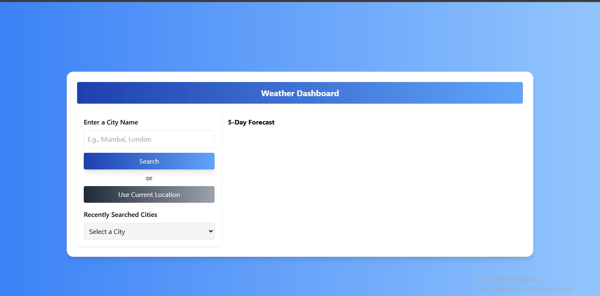
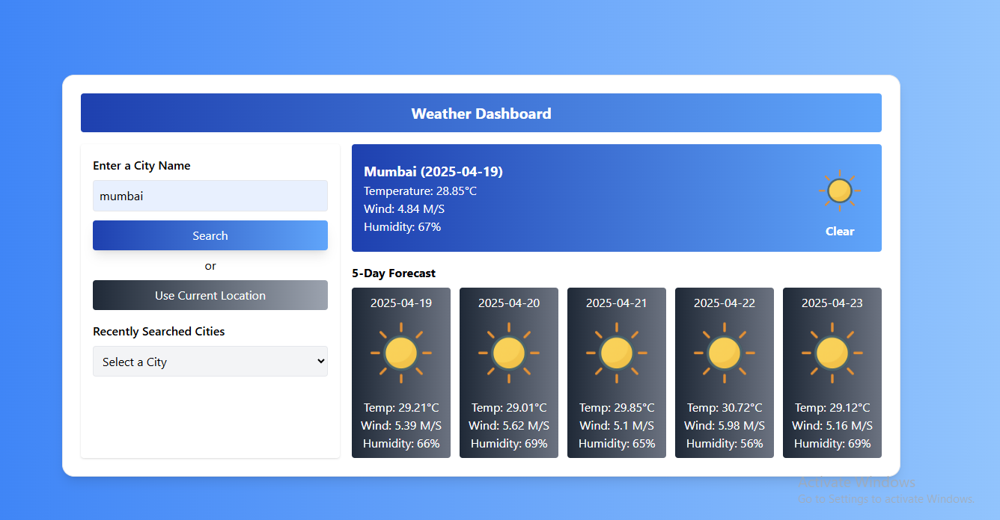
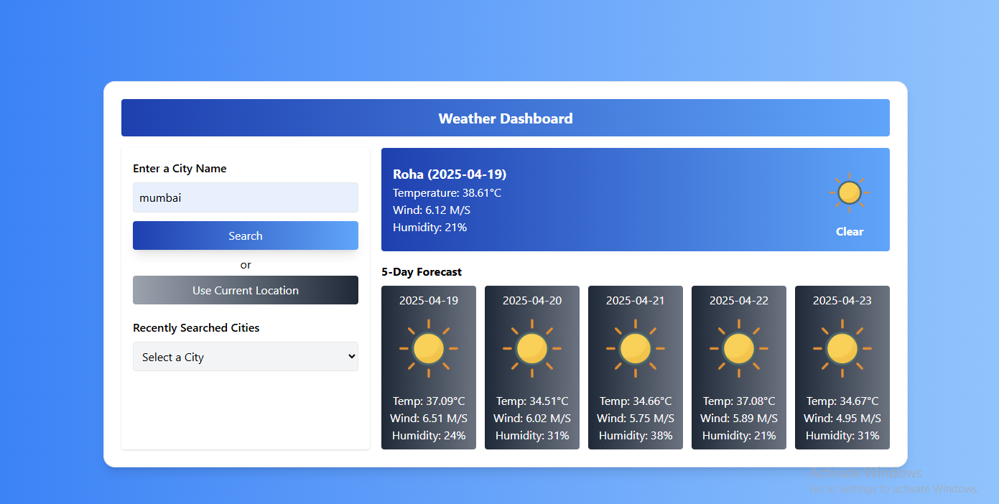
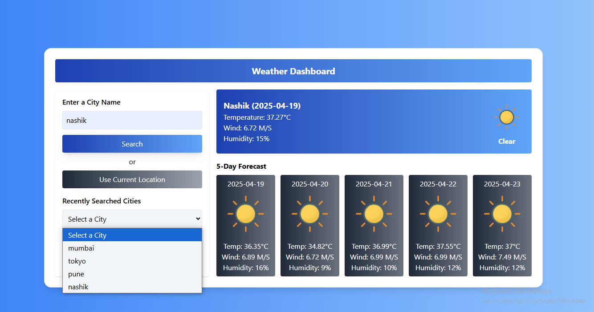
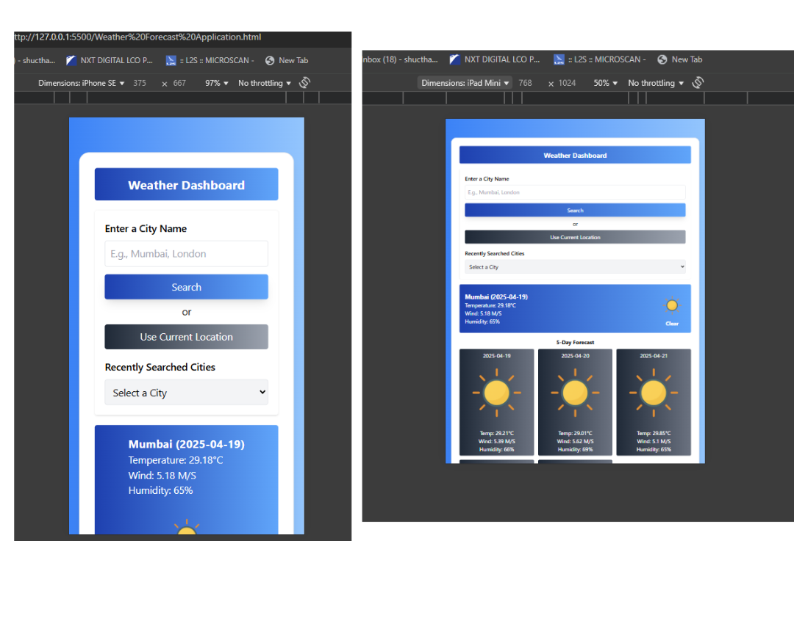
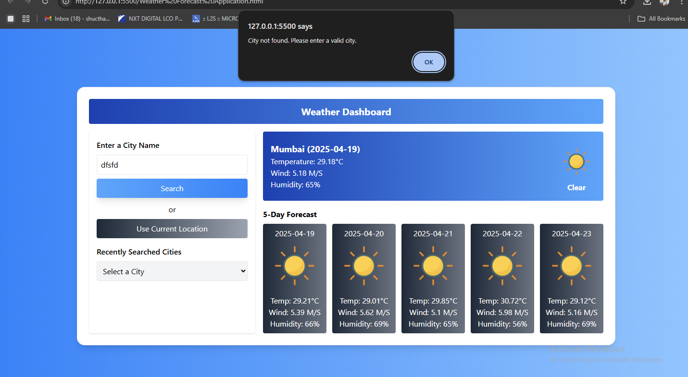

# Weather Forecast Application

The Weather Forecast Application provides real-time weather information with a user-friendly interface. It allows users to search by city name or fetch the weather data for their current location. The app also displays a 5-day weather forecast and keeps track of recently searched cities.

## Features

- **Search Weather by City**: Enter a city name to get current weather and a 5-day forecast.
- **Current Location Weather**: Fetch weather data based on your current location.
- **Recently Searched Cities**: Automatically saves your searches for easy access.
- **Current Weather Display**: Shows temperature, wind speed, humidity, and weather conditions with custom icons.
- **5-Day Forecast**: Displays weather forecasts for the next five days with key metrics.
- **Responsive Design**: Built with Tailwind CSS for seamless usability across devices.

## Technologies Used

1. **Frontend**:
   - HTML
   - Tailwind CSS
   - Vanilla JavaScript

2. **API**:
   - [OpenWeatherMap API](https://openweathermap.org/api)

3. **Storage**:
   - `sessionStorage` for storing recently searched cities.

## How It Works

1. **Search by City**:
   - Enter a city name in the input field and click the "Search" button or press `Enter`.
   - The app fetches weather data from OpenWeatherMap API and displays current weather and a 5-day forecast.

2. **Use Current Location**:
   - Click the "Use Current Location" button to fetch weather data using geolocation.

3. **Recently Searched Cities**:
   - The app saves your searched cities in `sessionStorage`.
   - You can select a city from the dropdown to quickly view its weather.

4. **Weather Data**:
   - The app uses the OpenWeatherMap API for real-time weather and forecast data.
   - Weather conditions are displayed with appropriate icons.

## Screenshots

### 1. First Page
This is the first page of the Weather App:



### 2. Search City and Weather Data
This is how the app looks when you search for a city:



### 3. Use Current Location and Weather Data
This shows the weather data fetched from your current location:



### 4. Recently Searched Cities
Here is how the recently searched cities dropdown looks:



### 5. Mobile Responsive
The app is fully responsive on mobile devices:



### 6. Error Handling (Invalid City)
This is the view when an invalid city is entered:



## Setup and Installation

1. Clone the repository:
   ```bash
   git clone https://github.com/Raj-2151-raj/Weather-Forecast-Application
   ```

2. Navigate to the project directory:
   ```bash
   cd Weather-Forecast-Application
   ```

3. Open the `Weather Application.html` file in your browser to view the app.

## Configuration

- Replace `<57f6cf6f75c188eac2ba40431266a455>` in the JavaScript file with your API key from OpenWeatherMap:
  ```javascript
  const apiKey = "<57f6cf6f75c188eac2ba40431266a455>";
  ```

## File Structure

```plaintext
weather-forecast-app/
│
├── Weather Application.html       # Main HTML file
├── README.md                      # Documentation
├── screenshot/                    # Folder for app screenshots
│   ├── first page.png             # Screenshot of the first page
│   ├── second.png                 # Screenshot of search city and weather data
│   ├── third.png                  # Screenshot of current location weather data
│   ├── forth.png                  # Screenshot of recently searched cities
│   ├── fifth.png                  # Screenshot of mobile responsive view
│   └── sixth.png                  # Screenshot of error handling (invalid city)
├── image/                         # Folder for weather icons and other assets
│   ├── Clear.png                  # Icon for clear weather
│   ├── CloudCH.png                # Icon for cloudy weather
│   ├── Rainy.png                  # Icon for rainy weather
│   ├── Drizzle.png                # Icon for drizzle
│   ├── SnowCH.png                 # Icon for snow
│   └── mist.png                   # Icon for misty weather
└── styles/                        # Folder for additional styles (if any)

## Future Enhancements

- Add a toggle to switch between Celsius and Fahrenheit.
- Use `localStorage` instead of `sessionStorage` for persistent city history.
- Add animations for better user experience.
- Improve error handling for API rate limits and network issues.

---

**Author**: Raj Thakur
Check my [GitHub Profile](https://github.com/Raj-2151-raj)